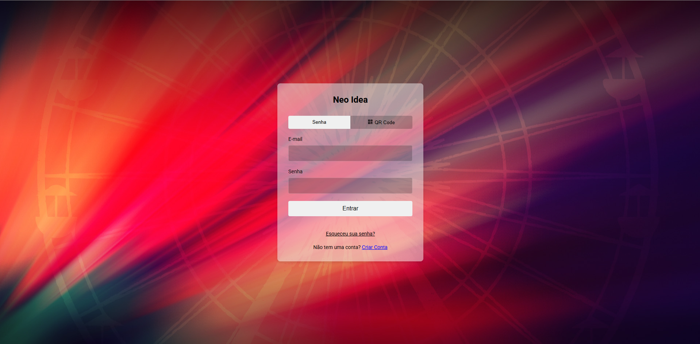
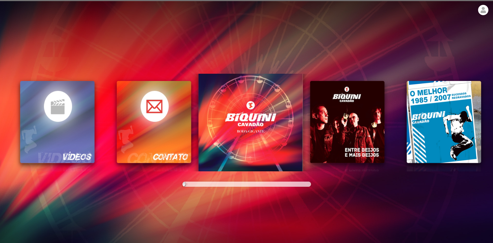
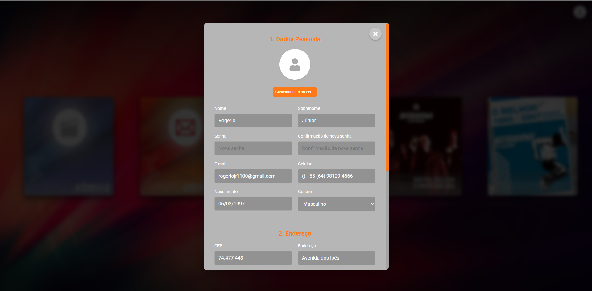
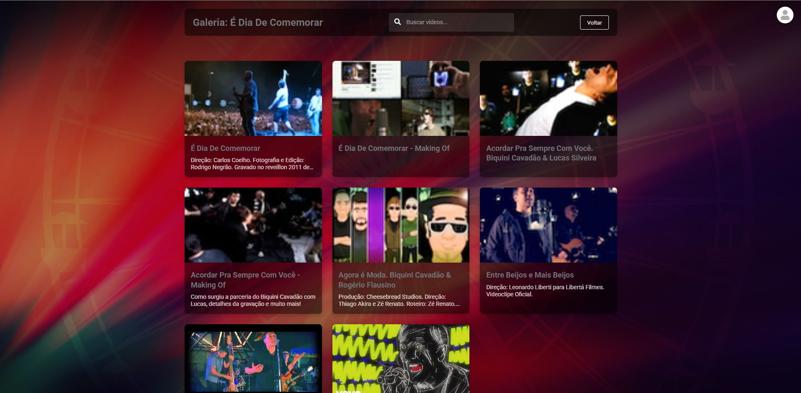
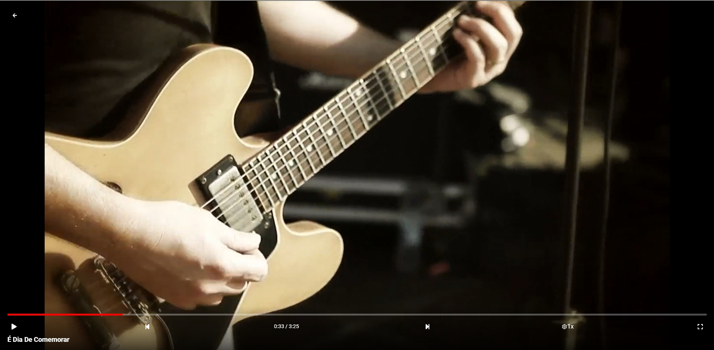

# Neo Idea - Plataforma de Streaming de Vídeos


## 📋 Sobre o Projeto

Neo Idea é uma plataforma moderna de streaming de vídeos desenvolvida com React e TypeScript. A aplicação oferece uma experiência de usuário intuitiva com autenticação segura, carrossel de conteúdo em destaque, galeria de vídeos e player integrado.

## Teste Frontend

### Descrição

Este é um projeto frontend que consome APIs da plataforma NeoIdea.

## 🖼️ Screenshots

### Tela de Login



_Descrição: Interface de autenticação com suporte a login tradicional e QR Code._

### Carrossel de Conteúdo



_Descrição: Carrossel interativo exibindo conteúdos em destaque com navegação intuitiva._

### Dados do usuário



_Descrição: Carrossel interativo exibindo conteúdos em destaque com navegação intuitiva._

### Galeria de Vídeos



_Descrição: Visualização em grid de vídeos disponíveis com informações detalhadas._

### Player de Vídeo



_Descrição: Player de vídeo com controles avançados e interface personalizada._

## 🚀 Tecnologias Utilizadas

- **React** - Biblioteca JavaScript para construção de interfaces
- **TypeScript** - Superset tipado de JavaScript
- **Vite** - Build tool e dev server
- **React Router** - Navegação entre páginas
- **Styled Components** - Estilização com CSS-in-JS
- **Zustand** - Gerenciamento de estado
- **Axios** - Cliente HTTP para requisições à API
- **React Slick** - Implementação do carrossel
- **React Icons** - Biblioteca de ícones

## 🔧 Requisitos

- Node.js (versão 14 ou superior)
- Yarn ou NPM
- Acesso à API Neo Idea

## ⚙️ Instalação

1. Clone o repositório:

```bash
git clone https://gitlab.com/mastercase/teste-frontend
cd teste-frontend
```

2. Instale as dependências:

```bash
yarn install
# ou
npm install
```

3. Configure as variáveis de ambiente:

```bash
cp .env.example .env
```

Edite o arquivo `.env` com as configurações apropriadas para seu ambiente.

4. Inicie o servidor de desenvolvimento:

```bash
yarn dev
# ou
npm run dev
```

5. Acesse a aplicação em [http://localhost:5175](http://localhost:5175)

## 🔐 Variáveis de Ambiente

O projeto utiliza variáveis de ambiente para configuração de endpoints e parâmetros da aplicação. Abaixo estão as principais variáveis que podem ser configuradas:

### Configurações da API

```env
# URL base para todas as requisições da API principal
VITE_API_BASE_URL=https://app.neoidea.com.br/sistema/index.php?r=outlet/services

# ID do cliente/marca (MDI)
VITE_MDI_ID=172

# URLs externas
VITE_ELIVE_API_URL=https://elive.neoidea.com.br/services.php
VITE_PODCAST_API_URL=https://app.neoidea.com.br/sistema/neowebservice/servercontent_cloudfront.php
```

### Endpoints da API

Todos os endpoints da API são configuráveis, permitindo apontar para diferentes ambientes (desenvolvimento, homologação, produção):

```env
# Endpoint para autenticação de usuário
VITE_ENDPOINT_AUTH=autenticaFaExterno

# Endpoint para obter layout da aplicação
VITE_ENDPOINT_GET_LAYOUT=getLayoutExterno

# Endpoint para obter itens do carrossel
VITE_ENDPOINT_GET_CAROUSEL=getCarrosselExterno

# Endpoint para verificar autenticação
VITE_ENDPOINT_VERIFY_AUTH=verificaAutenticacaoExterno

# Endpoint para recuperação de senha
VITE_ENDPOINT_RECOVER_PASSWORD=recuperarSenhaFaExterno

# Endpoints para autenticação de dois fatores
VITE_ENDPOINT_AUTH2=auth2Externo
VITE_ENDPOINT_VALIDATE_AUTH2=validarAuth2Externo
VITE_ENDPOINT_GENERATE_AUTH2_CHALLENGE=gerarDesafioAuth2Externo
VITE_ENDPOINT_VALIDATE_AUTH2_CHALLENGE=validarDesafioAuth2Externo

# Endpoints para contato
VITE_ENDPOINT_GET_CONTACT=getContatoExterno
VITE_ENDPOINT_SEND_CONTACT=enviarMensagemContatoExterno
```

### Configurações de Autenticação e Armazenamento

```env
# Chave para armazenar o token de autenticação no localStorage
VITE_AUTH_TOKEN_KEY=@NeoIdea:token

# Chave para armazenar os dados do usuário no localStorage
VITE_USER_DATA_KEY=@NeoIdea:user

# Método de criptografia utilizado
VITE_CRYPTO_METHOD=sha1
```

### Configurações de Ambiente

```env
# Define o ambiente atual (development, production)
VITE_NODE_ENV=development

# Porta do servidor de desenvolvimento/preview
VITE_PORT=5175
```

### Outras Configurações

```env
# Idioma padrão da aplicação
VITE_DEFAULT_LANG=pt-BR

# Fuso horário padrão
VITE_DEFAULT_TIMEZONE=America/Sao_Paulo

# Timeout da API (em milissegundos)
VITE_API_TIMEOUT=30000
```

Para mais detalhes, consulte o arquivo `.env.example` no repositório.

## 🔄 Ambientes de Execução

O projeto suporta diferentes ambientes de execução, cada um com suas configurações específicas:

### Ambiente de Desenvolvimento

Utilizado durante o desenvolvimento da aplicação:

1. Configure o arquivo `.env` com `VITE_NODE_ENV=development`
2. Execute o servidor de desenvolvimento:
   ```bash
   yarn dev
   # ou
   npm run dev
   ```

### Ambiente de Produção

Para testar a aplicação em um ambiente similar ao de produção:

1. Configure o arquivo `.env` com `VITE_NODE_ENV=production` ou use o arquivo `.env.production`
2. Gere o build de produção:
   ```bash
   yarn build:prod
   # ou
   npm run build:prod
   ```
3. Execute o servidor local para testar o build:
   ```bash
   yarn serve
   # ou
   npm run serve
   ```

Alternativamente, você pode usar o comando combinado:

```bash
yarn build:serve
# ou
npm run build:serve
```

## 🛠️ Scripts Disponíveis

O projeto inclui os seguintes scripts que podem ser executados com yarn ou npm:

### Desenvolvimento

```bash
# Inicia o servidor de desenvolvimento
yarn dev
# ou
npm run dev
```

### Build e Produção

```bash
# Gera o build de produção
yarn build
# ou
npm run build

# Gera o build de produção com otimizações específicas para ambiente de produção
yarn build:prod
# ou
npm run build:prod

# Limpa a pasta de build
yarn clean
# ou
npm run clean
```

### Servidor Local para Testes

```bash
# Inicia um servidor local para testar o build
yarn serve
# ou
npm run serve

# Gera o build e inicia o servidor local em um único comando
yarn build:serve
# ou
npm run build:serve
```

O servidor local para testes estará disponível em [http://localhost:5175](http://localhost:5175)

## 📁 Estrutura do Projeto

```
├── src/
│   ├── components/      # Componentes reutilizáveis
│   ├── contexts/        # Contextos React
│   ├── interfaces/      # Interfaces TypeScript
│   ├── pages/           # Páginas da aplicação
│   ├── services/        # Serviços e integrações com API
│   ├── stores/          # Stores Zustand para gerenciamento de estado
│   ├── types/           # Tipos TypeScript
│   ├── App.tsx          # Componente principal e rotas
│   └── main.tsx         # Ponto de entrada da aplicação
├── .env.example         # Exemplo de variáveis de ambiente
├── index.html           # Template HTML
├── package.json         # Dependências e scripts
├── tsconfig.json        # Configuração do TypeScript
└── vite.config.ts       # Configuração do Vite
```

## 🔐 Autenticação

A aplicação utiliza autenticação baseada em token com suporte a:

- Login com email e senha
- Autenticação de dois fatores (2FA)
- Login via QR Code

## 🌐 Endpoints da API

A aplicação consome os seguintes endpoints da API Neo Idea:

- Autenticação: `VITE_ENDPOINT_AUTH`
- Perfil do usuário: `VITE_ENDPOINT_GET_PROFILE`
- Atualização de perfil: `VITE_ENDPOINT_UPDATE_PROFILE`
- Listagem de conteúdos: `VITE_ENDPOINT_GET_NEOS`
- Vinculação de dispositivos: `VITE_ENDPOINT_LINK_DEVICE`

## 🔄 Fluxo de Dados

A aplicação utiliza o Zustand para gerenciamento de estado, com stores separadas para:

- `authStore`: Gerenciamento de autenticação e dados do usuário
- `themeStore`: Configurações de tema e layout
- `carouselStore`: Dados do carrossel de conteúdo
- `videoStore`: Gerenciamento de vídeos e reprodução

## 🧪 Testes

_Instruções para execução de testes serão adicionadas em breve._

## 📱 Responsividade

A aplicação é totalmente responsiva, adaptando-se a diferentes tamanhos de tela:

- Desktop (1024px e acima)
- Tablet (600px a 1023px)
- Mobile (abaixo de 600px)

## 🤝 Contribuição

1. Faça um fork do projeto
2. Crie uma branch para sua feature (`git checkout -b feature/nova-feature`)
3. Faça commit das suas alterações (`git commit -m 'Adiciona nova feature'`)
4. Faça push para a branch (`git push origin feature/nova-feature`)
5. Abra um Pull Request

## 📄 Licença

Este projeto está com licença livre do autor e a depender de autorização da equipe Neo Idea.

## 📞 Contato

- **Email**: rogeriojr1100@gmail.com
- **Website**: [Portfolio](https://rj-dev-portfolio-20.vercel.app/)

---

Desenvolvido com ❤️ para equipe Neo Idea
